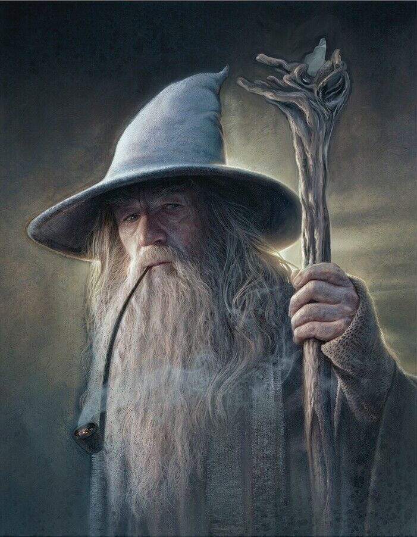

# Gendalf_bot

Данный репозиторий содержит код обучения модели, которая отвечает на реплики в стиле Гендальфа из Властелина Колец.
Данные, на которых обучалась модель, содержатся в файле Gandalf_Quotes.csv. 
В качестве модели была использована русскоязычная архитектура T5 из HuggingFace.

Файлы:
  * train.py - скрипт загрузки модели с HF и доубчения на Gandalf_Quotes.csv
  * bot.py - скрипт создания телеграмма бота с обученной моделью
  * model - сохранённая обученная модель
  * tokenizer - сохранённый токенайзер (использовался токенайзер по умолчанию)
  * images_gendalf - папка, в который содержатся изображения Гендальфа для отправки в телеграмм бот

Имя телеграмм бота с проектом: @test_medical1_bot
Приложение было обёрнуто в Docker-контейнер и развёрнуто на отдельном сервере

  

